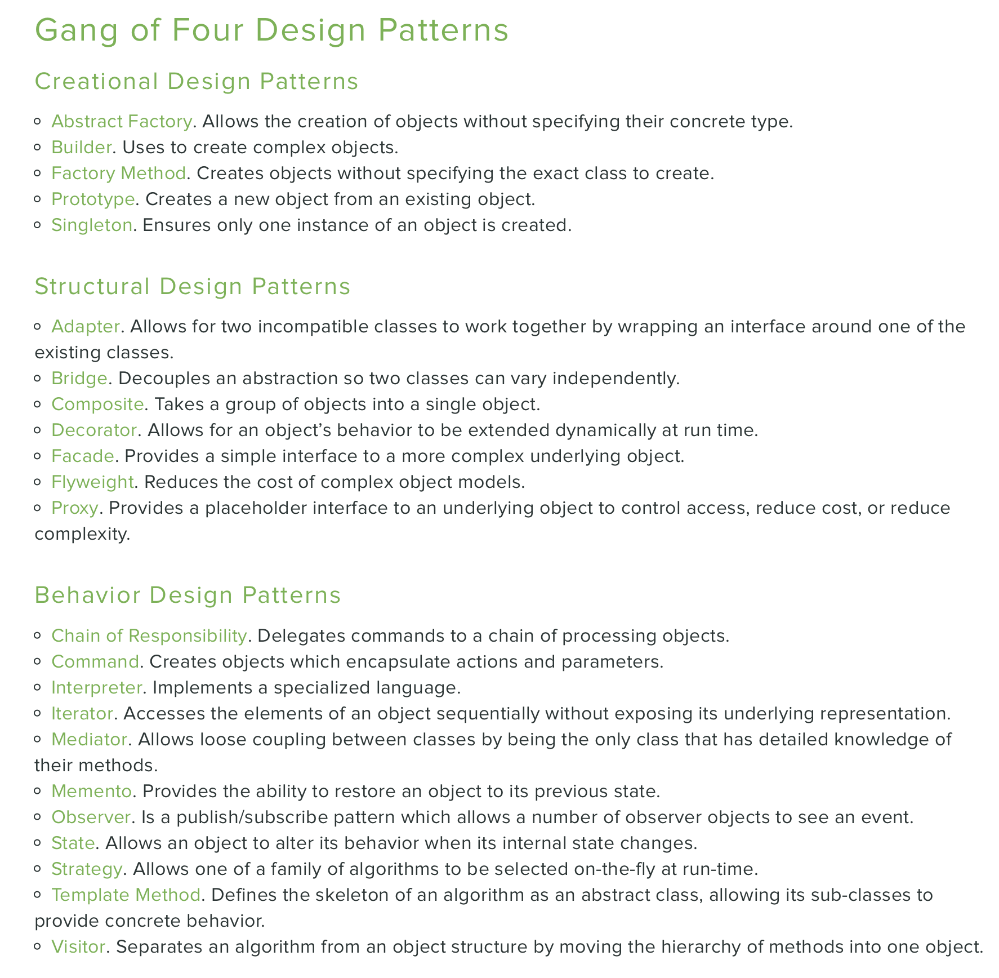
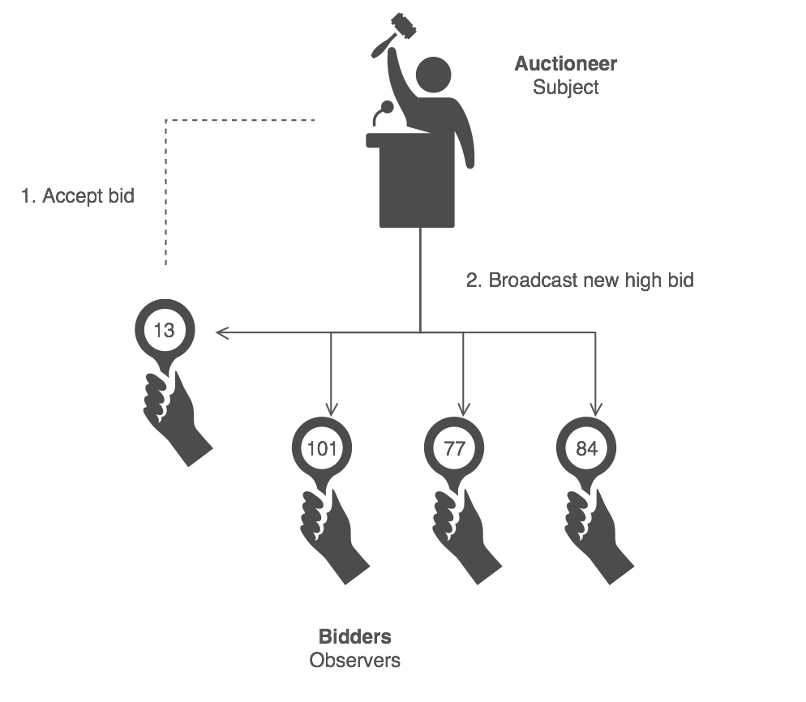

= My Notes in Python

:author: Sarp Yucel
:email: merdansarpyucel@gmail.com
:nofooter:

== Index

[.lead]

* Variable Types

* Usage of Asterisk - Send Multiple Parameters to Function with *args and **kwargs

* Design Patterns

** Decorators
** Singleton
** Facade
** Observer
** Iterator
* Dependency Injection

* Context Managers

* Generator Functions

* Multithread

* Garbage Colelctor

* Performance Improvement

* Street Coding

== Variable Types

- When an object is initiaded, it is assigned a unique object id. It's type is defined at runtime and once set can never
change, however it's state can be changed if it is mutable. Simple put, a mutable object can be changed after it is
created; immutable object can't.

- Mutable Object: Objects that can change after creation. (list, set, dict)

- Immutable Object: Objects that can't change after creation. (int, float, bool, str, tuple, unicode)

- Mutable/Immutable Table:

image::immutable.png["Immutable Table"]

== Usage of Asterisk - Send Multiple Parameters to Function with *Args and **Kwargs

- *args: Non-Keyword Arguments
    * Using the *, the variable that we associate with the * becomes an iterable meaning you can do things like iterate 
    over it, run some higher-order functions such as map and filter, etc.
- **kwargs: Keyword Arguments
    * A keyword argument is where you provide a name to the variable as you pass it into the function.

- We can unpack variables with using args and kwargs.

- single asterisk (*) is using for unpack iterables.
-- result return as tuple.

- double asterisk (**) is using for unpack dictionaries.
-- result return as dict.

.Unpacking With args or kwargs
[source, python]
----
include::asterisk/unpacking.py[]
----

.Output
[source, console]
----
Our List:  [6, 7, 8, 9, 10, 11] 

Unpack our list with * -> Asterisk
6 7 8 9 10 11

Unpack [6, 7, 8, 9, 10, 11] with multiple *args
6 [7, 8, 9, 10] 11
----

- We can merge items with using args or kwargs (depends on data type)

.Merging items with Asterisk Operator
[source, python]
----
include::asterisk/merging.py[]
----

.Output
[source, console]
----
Two lists: [5, 6, 7] and [5, 66, 77]
Merged List with Asterisk: [5, 6, 7, 5, 66, 77]

Two dicts: {'a': 2, 'b': 3, 'c': 4} and {'c': 6, 'd': 41, 'e': 19}    
Merged Dict With Asterisk: {'a': 2, 'b': 3, 'c': 6, 'd': 41, 'e': 19} 
----

- args or kwargs names are just names. We can change this names when we are using. Important part is the asterisk(*)

- We can send parameters to a function without using args or kwargs, of course. But sometimes we wouldn't know how many
parameters come to our function. In that cases, we can use args or kwargs.

.Multiple Parameters Wihtout Args/Kwargs Examples
[source, python]
----
include::asterisk/multiple_parameters_one.py[]
----

.Output
[source, console]
----
1. element: 6
2. element: 7
3. element: 8
4. element: 9
Sumamry of Integer List:  30
***********************
Numbers are 14 and 15
Summary of Two Numbers:  29
----

- We can use *args for list type variables.

.Multiple Parameters with *args
[source, python]
----
include::asterisk/multiple_parameters_two.py[]
----

.Output
[source, console]
----
*args seems like:  ((6, 7, 8, 9),)
*args type is:  <class 'tuple'>
(6, 7, 8, 9)
***********************
*args seems like:  (6, 7, 8, 9)
*args type is:  <class 'tuple'>
1. element: 6
2. element: 7
3. element: 8
4. element: 9
Summary of Integers:  30
----

- We can use **kwargs for dictionary type variables.

.Multiple Parameters with **kwargs
[source, python]
----
include::asterisk/multiple_parameters_three.py[]
----

.Output
[source, console]
----
**kwargs seems like:  {'a': 6, 'b': 7, 'c': 8, 'd': 9}
**kwargs type is:  <class 'dict'>
a:6
b:7
c:8
d:9
Sumamry of Numbers:  30
----

- When defining a function, every parameter has its own order.

.Defining Function with * Operator
[source, python]
----
include::asterisk/usage.py[]
----

== Design Patterns

- Design patterns are solutions to general problems that software developers faced during software development. These
solutions were obtained by trial and error by numerous software developers over quite a sibstanial period of time.

- Gang of Four: The four authors of the book: Erich Gamma, Richard Helm, Ralph Johnson, and John Vlissides, 
have since been dubbed “The Gang of Four”.

- The GoF Design Patterns are broken into three categories: 
- Creational Patterns for the creation of objects
- Structural Patterns to provide relationship between objects
- Behavioral Patterns to help define how objects interact.

- Some Principles to Follow
* Never create things that shouldn’t be created: Your classes should follow the single responsibility principle;
the idea that a class should only do one thing.

* Keep constructors simple: Constructors should be kept simple. The constructor of a class shouldn’t be doing any work — 
that is, they shouldn’t be doing anything other than checking for null, creating creatables, and storing dependencies 
for later use. They shouldn’t include any coding logic.

* Don’t assume anything about the implementation: Interfaces are, of course, useless without an implementation. 
However, you, as a developer, should never make any assumptions about what that implementation is.

=== Behavioral Patterns

==== Iterators

- Iterators allow us to traverse the elements of the collections without taking the exposure of in-depth details of the 
elements. It provides a way to access the elements of complex data structure sequentially without repeating them.
- According to GangOfFour, Iterator Pattern is used ”to access the elements of an aggregate object sequentially 
without exposing its underlying implementation”.
- It’s not always a good habit to use the Iterator Method because sometimes it may prove as an overkill of resources 
in a simple application where complex things are not required.
- Passing the new iterators and collections into the client code does not break the code can easily be installed 
into it.
- An iterator is an object that contains a countable number of values.
- Iterator is an object which implements the iterator protocol, which consist of the methods __iter__() and __next__().
- Lists, tuples, dictionaries, and sets are all iterable objects. They are iterable containers which you can get an 
iterator from.

- The for loop actually creates an iterator object and executes the next() method for each loop.

.Iterator 101
[source, python]
----
include::design_patterns/iterator/iterator_1.py[]
----

.Output
[source, console]
----
notifier
asgard
C
a
f
e
X
O
R
----

- To create an object/class as an iterator you have to implement the methods __iter__() and __next__() to your object.
- The __iter__() method acts similar, you can do operations (initializing etc.), but must always return the iterator 
object itself.
- The __next__() method also allows you to do operations, and must return the next item in the sequence.
- We can add stop condition to __next__ method.

.Create an Iterator
[source, python]
----
include::design_patterns/iterator/iterator_2.py[]
----

.Output
[source, console]
----
1
3
5
For Loop after using 3 times! 
For Loop: 1
For Loop: 3
For Loop: 5
For Loop: 7
For Loop: 9
For Loop: 11
For Loop: 13
For Loop: 15
----

==== Observers

- An object, called the Subject (Observable), manages a list of dependents, called Observers, and notifies them 
automatically of any internal state changes by calling one of their methods.
- The Observer pattern follows the publish/subscribe concept. A subscriber, subscribes to a publisher. The publisher 
then notifies the subscribers when necessary.
- The observer stores state that should be consistent with the subject. The observer only needs to store what is 
necessary for its own purposes.
- Define a one-to-many dependency between objects so that when one object changes state, all its dependents are 
notified and updated automatically.
- Encapsulate the core (or common or engine) components in a Subject abstraction, and the variable 
(or optional or user interface) components in an Observer hierarchy.

.Observer Example
----
include::design_patterns/observer/observer_1.py[]
----

.Output
[source, console]
----

----

=== Structural Patterns

==== Decorators

- Decorators provide simple syntax for calling high order functions.
- High Order Function: In mathematics and computer science, a high-order function is a function that does at least one
of the following:
    * take one or more functions as arguments (i.e procedural parameters),
    * returns a function as its result.
- All the other functions are first-order functions.
- By definition, a decorator is a function that takes another function and extends the behaviour of the latter function
without explicitly modfying it. And we use decorator a lot :D

- I wrote decorators.py and added two decorators in it. Then I used these decorators in another file.

.Decorators
----
include::design_patterns/decorator/decorators.py[]
----

.Usage of Decorators
----
include::design_patterns/decorator/example.py[]
----

.Output
[source, console]
----
Exception Occured! ->  division by zero
Exception Occured! ->  unsupported operand type(s) for /: 'int' and 'str'
I'm only sleeping
Elapsed Time: 3.005300998687744 seconds
----

==== Facade

- According to GoF, Facade design pattern is defind as:
Provide a unified interface to a set of interfaces in a subsystem. Facade Pattern defines a higher-level interface that 
makes the subsystem easier to use.

- Facade can be recognized in a class that has a simple interface, but delegates most of the work to other classes. 
Usually, facades manage the full life cycle of objects they use.

-  Facade pattern hides the complexities of the system and provides an interface to the client using which the client 
can access the system. This type of design pattern comes under structural pattern as this pattern adds an interface to 
existing system to hide its complexities.

.Example Facade Pattern for Complex Coffee Machine
----
include::design_patterns/facade/facade.py[]
----

.Output
[source, console]
----
Coffee Grind Operation Completed! It tooks 8.64 seconds
Water is ready! It tooks 156.66666666666666 seconds. 
Distill Operation Completed! It tooks 282.3 seconds.
Filter Coffee Is ready for 3 cups.
----

=== Creational Patterns

==== Singleton

- Use the Singleton pattern when a class in your program should have just a single instance available to all clients.
- Singleton is a creational design pattern, which ensures that only one object of its kind exists and provides a single 
point of access to it for any other code. Singleton has almost the same pros and cons as global variables.
- Using a singleton pattern has many benefits. A few of them are:
* To limit concurrent access to a shared resource.
* To create a global point of access for a resource.
* To create just one instance of a class, throughout the lifetime of a program.

- Give examples.

=== Dependency Injection

- Dependency Injection is "D" for SOLID Principles.
* S - Single-responsiblity Principle
* O - Open-closed Principle
* L - Liskov Substitution Principle
* I - Interface Segregation Principle
* D - Dependency Inversion Principle
- Dependency Injection is an object-oriented software design principle that creates less fragile code and makes 
writing tests easier by decoupling lower-level classes from higher-level classes.
- Minimalistic dependencies — As the dependencies are clearly defined, easier to eliminate/reduce unnecessary 
dependencies.
- Code with reduced module complexity, increased module reusability.
- Instantiating mock objects and integrating with class definitions is easier. (Easy To Test :D)
- Flexibility of configurable components.

.Without Dependency Injection Principles
----
include::design_patterns/dependency_injection/without_di.py[]
----

.Output
[source, console]
----
[13-06-2021 20:39:25] -> Joy Division Concert at Concert Hall
----

.With Dependency Injection Principles
----
include::design_patterns/dependency_injection/with_di.py[]
----

.Output
[source, console]
----
[13-06-2021 20:39:25] -> Joy Division Concert at Concert Hall
----

- Benefits of Dependency Injection
* Maintainability: Probably the main benefit of dependency injection is maintainability. 
If your classes are loosely coupled and follow the single responsibility principle — the natural result of using DI — 
then your code will be easier to maintain.
* Testability: Along the same lines as maintainability is testability. Code that is easy to test is tested more often. 
More testing means higher quality.
* Readability: Code that uses DI is more straightforward. It follows the single responsibility principle and 
thus results in smaller, more compact, and to-the-point classes.
* Flexibility: Loosely coupled code — yet again, the result of using dependency injection — is more flexible and usable 
in different ways. Small classes that do one thing can more easily be reassembled and reused in different situations
* Extensibility: Code that uses dependency injection results in a more extendable class structure. By relying on 
abstractions instead of implementations, code can easily vary a given implementation.
* Team-ability: If you are on a team and that team needs to work together on a project (when is that not true?), 
then dependency injection will facilitate team development.

== Generator Functions

- Python provides a generator to create your own iterator function. 
- A generator is a special type of function which does not return a single value, instead, it returns an iterator 
object with a sequence of values. In a generator function, a yield statement is used rather than a return statement.

- The generator functions can't include return! If we add "return", function will be terminated.
- "yield" returns a value and pauses the execution.

.Generators 101
----
include::generators/generators_1.py[]
----

.Output
[source, console]
----
First Step!
After first
Second Step!
After Second
Dev'sTEP!!
----

- Generators can be use with loops
.Generators with loops
----
include::generators/generators_2.py[]
----

.Output
[source, console]
----
1
4
9
16
Iteration has stopped.
----

== Context Managers

- Context managers allow you to allocate and release resources precisely when you want to. The most widely used example 
of context managers is the "with" statement.
- Suppose you have two related operations which you’d like to execute as a pair, with a block of code in between. 
Context managers allow you to do specifically that.

.Context Manager 101
----
include::context_manager/context_manager_1.py[]
----

- We can implement Context Manager as class.
- 1. The with statement stores the __exit__ method of the File class.
- 2. It calls the __enter__ method of the File class.
- 3. The __enter__ method opens the file and returns it.
- 4. The opened file handle is passed to opened_file.
- 5. We write to the file using .write().
- 6. The with statement calls the stored __exit__ method.
- 7. The __exit__ method closes the file.

.Implementing a Context Manager as a Class
----
include::context_manager/context_manager_2.py[]
----

- Handling Exception: Type, value and traceback arguments of the __exit__ method. Between the 4th and 6th step, if an 
exception occurs, Python passes the type, value and traceback of the exception to the __exit__ method. It allows the 
__exit__ method to decide how to close the file and if any further steps are required. 
- 1. It passes the type, value and traceback of the error to the __exit__ method.
- 2. It allows the __exit__ method to handle the exception.
- 3. If __exit__ returns True then the exception was gracefully handled.
- 4. If anything other than True is returned by the __exit__ method then the exception is raised by the with statement.

- Our __exit__ method returned True, therefore no exception was raised by the with statement.

.Exception Handling in Context Manager
----
include::context_manager/context_manager_3.py[]
----

- Context manager can be used as generator.
- 1. Python encounters the yield keyword. Due to this it creates a generator instead of a normal function.
- 2. Due to the decoration, contextmanager is called with the function name (open_file) as its argument.
- 3. The contextmanager decorator returns the generator wrapped by the GeneratorContextManager object.
- 4. The GeneratorContextManager is assigned to the open_file function. Therefore, when we later call the open_file 
function, we are actually calling the GeneratorContextManager object.

.Implement Context Manager as Decorator
----
include::context_manager/context_manager_4.py[]
----

== Multithread

- Multiple threads within a process share the same data space with the main thread and can therefore share information 
or communicate with each other more easily than if they were separate processes.
- Threads sometimes called light-weight processes and they do not require much memory overhead; 
they are cheaper than processes.
- A thread has a beginning, an execution sequence, and a conclusion. It has an instruction pointer that keeps track 
of where within its context it is currently running.
- We have a function that send request to 3rd Party API and it may be take a few seconds.
- Let's write a program without multithread and convert to multithread and compare programs run times.

.Program Without Multithread
[source, python]
----
include::multithread/example_without_multithread.py[]
----

.Output
[source, console]
----
It takes 32.048429012298584 seconds
----

- We separate functions and data because program runs with threads. We must know what each threads do on their lifetime.

.Same Program With Multithread
[source, python]
----
include::multithread/example_with_multithread.py[]
----

.Output
[source, console]
----
It takes 4.031013011932373 seconds
----

- Disadvantages of Multithreading:
* On a single processor system, multithreading won’t hit the speed of computation. The performance may downgrade due 
to the overhead of managing threads.
* Multithreading increases the complexity of the program, thus also making it difficult to debug.
* It raises the possibility of potential deadlocks.
* It may cause starvation when a thread doesn’t get regular access to shared resources. The application would 
then fail to resume its work.

== Garbage Collector/Collection

- The Garbage Collector is keeping track of all objects in memory. A new object starts its life in the first generation
of the garbage collector. If Python executes a garbage collection process on a generation and an object survives, it
moves up into second, older generation.
- How Python implements garbage collection There are two aspects to memory management and garbage collection in CPython:
    * Reference counting: At a very basic level, a Python object’s reference count is incremented whenever the object is 
    referenced, and it’s decremented when an object is dereferenced. If an object’s reference count is 0, the memory for 
    the object is deallocated.
    * Generational garbage collection: There are two key concepts to understand with the generational garbage collector.
        ** The first concept is that of a generation.
        ** The second key concept is the threshold.
    * The garbage collector is keeping track of all objects in memory. 
    A new object starts its life in the first generation of the garbage collector. If Python executes a garbage 
    collection process on a generation and an object survives, it moves up into a second, older generation. The Python 
    garbage collector has three generations in total, and an object moves into an older generation whenever it 
    survives a garbage collection process on its current generation.
    * For each generation, the garbage collector module has a threshold number of objects. If the number of objects 
    exceeds that threshold, the garbage collector will trigger a collection process. For any objects that survive that 
    process, they’re moved into an older generation.
    * Unlike the reference counting mechanism, you may change the behavior of the generational garbage collector 
    in your Python program. This includes changing the thresholds for triggering a garbage collection process in your 
    code. Additionally, you can manually trigger a garbage collection process, or disable the garbage collection 
    process altogether.

.GC(Garbage Collection) Module Get Methods.
[source, python]
----
include::garbage_collection/gc_module_1.py[]
----

.Output
[source, console]
----
Threshoold:  (700, 10, 10)
Number Of Objects in Generation:  (544, 4, 1)
(544, 4, 1)
0
(1, 0, 0)
----
- Running a garbage collection process cleans up a huge amount of objects—there are 544 objects in the first generation 
and 5 (4, 1) more in the older generations.

- We can change thresholds.

.GC(Garbage Collection) Module Set Methods.
[source, python]
----
include::garbage_collection/gc_module_2.py[]
----

.Output
[source, console]
----
Threshoold:  (700, 10, 10)
Threshoold:  (1000, 20, 30)
----

- In the example above, we increase each of our thresholds from their defaults. Increasing the threshold will reduce the 
frequency at which the garbage collector runs. This will be less computationally expensive in your program at the 
expense of keeping dead objects around longer.

NOTE: Don’t change garbage collector behavior: As a general rule, you probably shouldn’t think about Python’s garbage 
collection too much. One of the key benefits of Python is it enables developer productivity. Part of the reason for this 
is because it’s a high-level language that handles a number of low-level details for the developer.

- EXAMPLE: The Instagram (Django) team disabled the garbage collector module by setting the thresholds for all 
generations to zero. This change led to their web applications running 10% more efficiently.

== Performance Improvement

- I want to mention about some python performance trics. (with comparsion)
- Using list comphersions.

.List Comphersions
[source, python]
----
include::performance_improvements/first.py[]
----

.Output
[source, console]
----
Elapsed Time: 0.0069141387939453125 seconds
Elapsed Time: 0.00476837158203125 seconds
----

- If you’re working with lists, consider writing your own generator to take advantage of this lazy loading and memory 
efficiency. Generators are particularly useful when reading a large number of large files. It’s possible to process 
single chunks without worrying about the size of the files.

- Remember to use multiple assignment. But Newer versions of python, these are same :D
.Multiple Assignments
[source, python]
----
include::performance_improvements/second.py[]
----

.Output
[source, console]
----
Elapsed Time: 0.00095367431640625 seconds
Elapsed Time: 0.00095367431640625 seconds
----

- Avoid global variables. Using few global variables is an effective design pattern because it helps you keep track of 
scope and unnecessary memory usage. 

- Try to leave a function as soon as you know it can do no more meaningful work.

- Use operator itemgetter keys for sort operations.
- Maybe game or demo examples. (DEMO CULTURE)
- Common Usages
- Our Examples

== Street Coding

- What is Street Coding?
- Why we need them / Advantages
- Common Usages
- Our Examples