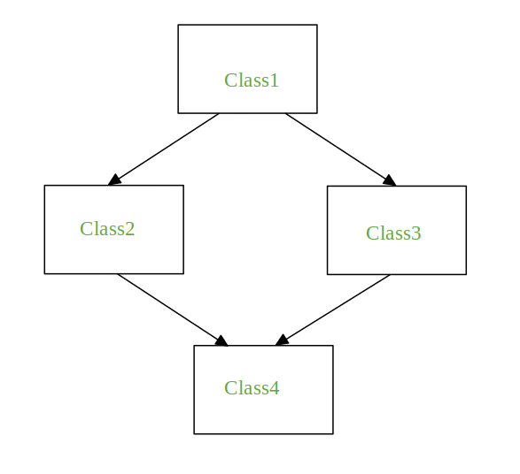

= Object Oriented Programming in Python

:author: Sarp Yucel
:email: merdansarpyucel@gmail.com
:nofooter:

== Terminology

[.lead]
I want to start with terminolgic words which uses in OOP in Python.

* Class
- A user-defined prototype for an object that defines a set of attributes that characterize any object of the class. 
The attributes are data members (class variables and instance variables) and methods, accessed via dot notation.

* Class Variable
- A variable that is shared by all instances of a class. Class variables are defined within a class but outside any of 
the class's methods. Class variables are not used as frequently as instance variables are.

* Data Member
- A class variable or instance variable that holds data associated with a class and its objects.

* Function Overloading
- The assignment of more than one behavior to a particular function. The operation performed varies by the types of 
objects or arguments involved.

* Instance Variable
- A variable that is defined inside a method and belongs only to the current instance of a class.

* Inheritance
- It refers to defining a new class with little or no modification to an existing class. The new class is called derived
(or child) class and the one from which it inherits is called the base (or parent) class.

* Encapsualtion
- Packing of data and functions operating on that data into a single component and restricting the access to some of the
object's components. Encapsulation means that the internal representation of an object is generally 
hidden from view outside of the object's definition.

* Instance
- An individual object of a certain class. 
An object obj that belongs to a class Person, for example, is an instance of the class Person.

* Instantiation
- The creation of an instance of a class.

* Method
- A special kind of function that is defined in a class definition.

* Object
- A unique instance of a data structure that's defined by its class. 
An object comprises both data members (class variables and instance variables) and methods.

* Operator Overloading
- The assignment of more than one function to a particular operator.

* Constructors
- Constructors are generally used for instantiating an object.The task of constructors is to initialize(assign values) 
to the data members of the class when an object of class is created.In Python the __init__() method is called 
the constructor and is always called when an object is created.

* Destructors
Destructors are called when an object gets destroyed. In Python, destructors are not needed as much needed in C++
because Python has a garbage collector that handles memory management automatically.

* Context Manager
- That allows us to allocate and release resources precisely when we want to. The most widely used example of context
manager is the "with" statement.

* Generator Functions
- Simply speaking, a generator is a function that returns an object (iterator) which we can 
iterate over (one value at a time).

* Garbage Collector
- The garbage collector is keeping track of all objects in memory. A new object starts its life in the first generation
of the garbage collector. If Python executes a garbage collection process on a generation and an object survives, 
it moves up into a second, older generation.

== Classes

.Define A Class
[source, python]
----
include::class_1.py[]
----

.Output
[source, console]
----
Selami
77
Male
----

- The first method __init__() is a special method, which is called class constructor or initialization method that Python calls when you create a new instance of this class.

.Define A Class with Default Paremeters
[source, python]
----
include::class_2.py[]
----

.Output
[source, console]
----
person_one's Name: Regen KID, Age: 23, Sex: None
person_two's Name: Debbie Harry, Age: 75, Sex: Female 
----

- Classes can have their own functions (a.k.a 'METHOD'). 

.Class Methods
[source, python]
----
include::class_3.py[]
----

.Output
[source, console]
----
person_two's Name: Debbie Harry, Age: 75, Location: Turkey
Debbie Harry's bank acoount id is: 37652487
----

=== Encapsulation

- We can reach and change the objects variables. Sometetimes We may prohibit the access from out of scope (for security etc.) to functions or variables. So with using "encapsulation", we can prevent undesired usages.

- Most programming languages has three forms of access modifiers, which are Public, Protected and Private in a class.

- In python, we define functions or variables as these three of access modifiers with underscope (_).

** method_name or variable_name -> Public
** _method_name  or _variable_name -> Protected (One Underscope)
**  +__method_name+ or  +__variable_name+ -> Private (Double Underscope)

.Encapsulation of Object's variables
[source, python]
----
include::encapsulation_1.py[]
----

.Output
[source, console]
----
person_two's Name: Debbie Harry, Age: 75, Sex: Female
Traceback (most recent call last):
  File "C:\Users\user\Projects\python_oop\encapsulation_1.py", line 14, in <module>     
    print(f"person_two's Name: {person_two.name()}, Age: {person_two.age}, Sex: {person_two.sex}")
AttributeError: 'Person' object has no attribute 'name'
----

- We couldn't get name value from out of class scope because name is private value, so we wrote a getter method which is public function to reach this variable. 

.Protected Methods and Variables
[source, python]
----
include::encapsulation_2.py[]
----

.Output
[source, console]
----
Developer's Name:  Dennis Ritchie
Age:  70
Location:  USA
----

- The members of a class that are declared protected are only accessible to a class derived from it

.Private Method and Variables
[source, python]
----
include::encapsulation_3.py[]
----

.Output
[source, console]
----
Person Details: Debbie Harry 75 USA
Traceback (most recent call last):
  File "C:\Users\user\Projects\python_oop\encapsulation_3.py", line 25, in <module>
    person_one.__print_person_details()
AttributeError: 'Person' object has no attribute '__print_person_details'
----

- In Java or e.g. people are recommended to use only private attributes with getters and setters, so that they can 
change the implementation without having to change the interface.

- Python offers a solution to this problem. The solution is called properties!

- Note: The actual money value is stored in the private _money variable. The money attribute is a property object which 
provides an interface to this private variable.

.Properties Getter Setter
[source, python]
----
include::properties.py[]
----

.Output
[source, console]
----
Set Salary Method Running ... 
You're POOR! You should pay more taxes       
Get Salary Method Running ...
Debbie Harry's real salary is: 2666.4        
Set Salary Method Running ...
You're RICH! You should pay taxes
Get Salary Method Running ...
Debbie Harry's real salary is: 1833600.0
----

- We used directly variable property to modify _{variable_name} attribute. However, it is still accessible in Python.
Hence, the responsible programmer would refrain from accessing and modifying instance variables 
prefixed with _ from outside its class.

=== Inheritance
- Inheritance models what is called an is a relationship. This means that when you have a Derived class that inherits 
from a Base class, you created a relationship where Derived is a specialized version of Base. +

** Classes that inherit from another are called derived classes, subclasses, or subtypes.
** Classes from which other classes are derived are called base classes or super classes.
** A derived class is said to derive, inherit, or extend a base class.

** Overriding: Method overriding is thus a part of the inheritance mechanism. In Python method overriding occurs by 
simply defining in the child class a method with the same name of a method in the parent class.

*** So We must define __init__ (constructor) again for child classess.

** Interface: For an object, is a set of methods and attributes on that object.

** In Python, we can use an abstract base class to define and enforce an interface.

*** At a high level, an interface acts as a blueprint for designing classes. Like classes, interfaces define methods. 
Unlike classes, these methods are abstract. An abstract method is one that the interface simply defines. 
It doesn’t implement the methods. This is done by classes, which then implement the interface and 
give concrete meaning to the interface’s abstract methods.

*** Python’s approach to interface design is somewhat different when compared to languages like Java, Go, and C++. 
These languages all have an interface keyword, while Python does not. 
Python further deviates from other languages in one other aspect. 
It doesn’t require the class that’s implementing the interface to define all of the interface’s abstract methods.

** This is known as the Liskov substitution principle. The principle states that “in a computer program, if S is a 
subtype of T, then objects of type T may be replaced with objects of type S without 
altering any of the desired properties of the program”.

.Using Inheritence and Overriding
[source, python]
----
include::inheritance_1.py[]
----

.Output
[source, console]
----
person_1's age: 33 and real age: 33
musician_1's age: 75 and real age: 75
developer_1's age: 70 and real age: 105.0
----

** Abstract Base Classes
*** With Using Abstract Class;
**** Telling users of the module that objects of type Base Class can’t be created.
**** Telling other developers working on the same module that if they derive from Base Class, then they must override the abstract method.

.Using Abstract Classes for Inherit A Function
[source, python]
----
include::inheritance_2.py[]
----

.Output
[source, console]
----
0.14285714285714285
Traceback (most recent call last):
  File "C:\Users\user\Projects\advanced-python\inheritance_2.py", line 37, in <module>     
    person_1 = Person("John Doe", 123)
TypeError: Can't instantiate abstract class Person with abstract method calculate_happiness
----

** We accessed to inherited class but we couldn't accessed to abstract class and method.

Multiple Inheritence: When a class is derived from more than one base class it is called multiple Inheritance. 
The derived class inherits all the features of the base case.

.Multiple Inheritence
[source, python]
----
include::inheritence_multi.py[]
----

.Output
[source, console]
----
You cannot change your nickname
Person ONE: Ada Lovelace, 206
Developer ONE: John Anderson, Neo, SomeWhereCoop, USA        
Hybrid ONE: Fiona Apple, 45, Fiona, SomeWhereCoop, USA       
Getting Person Name ....
Fiona Apple
Hybrid ONE: Fiona Apple, 46, Hot Knife, SomeWhereCoop, Turkey
----

- Diamond Problem:

** It refers to an ambiguity that arises when two classes Class2 and Class3 inherit from a superclass
Class1 and class Class4 inherits from both Class2 and Class3. If there is a method “m” which is an overridden method
in one of Class2 and Class3 or both then the ambiguity arises which of the method “m” Class4 should inherit.